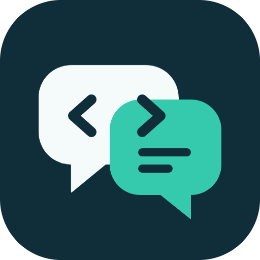
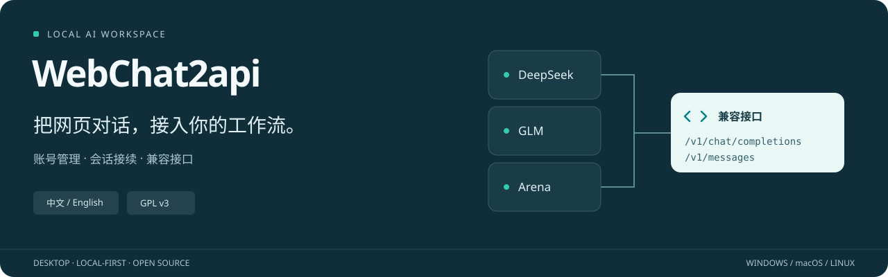
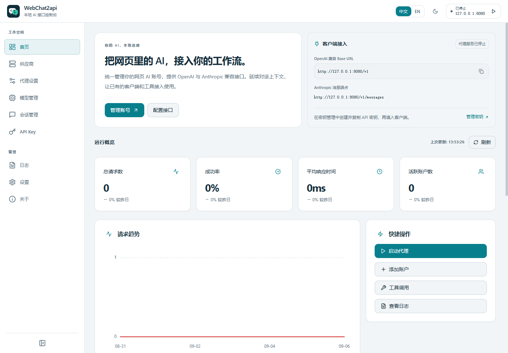
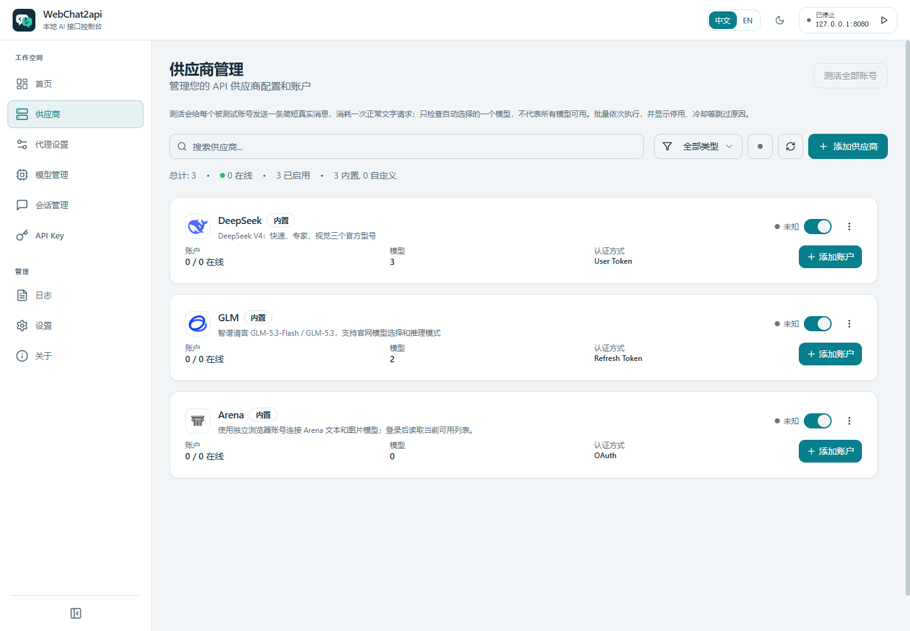
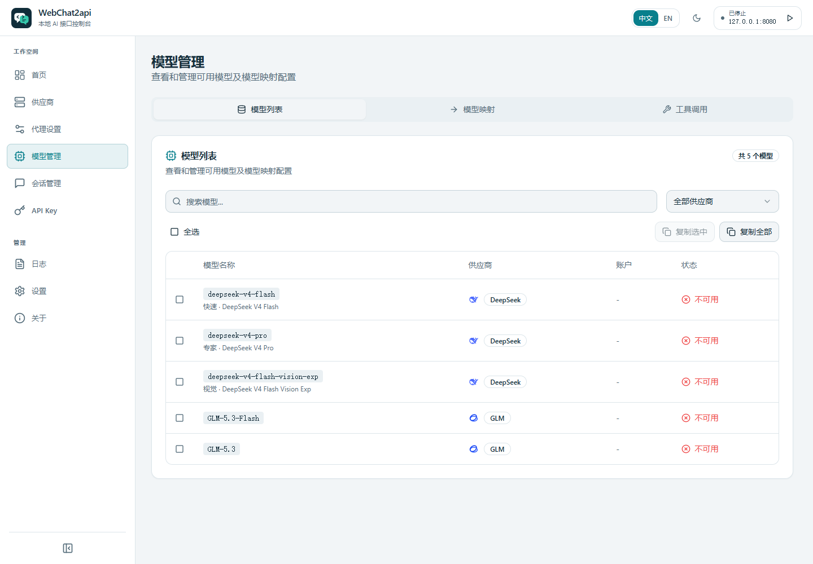

<p align="center">
  
</p>

<h1 align="center">WebChat2api</h1>
<p align="center">管理网页 AI 账号，把熟悉的对话接入你的客户端。</p>
<p align="center"><strong>中文</strong> | <a href="README_EN.md">English</a></p>
<p align="center"><a href="docs/README.md">文档导航</a> · <a href="docs/local-deployment.md">本地部署</a> · <a href="docs/claude-code.md">Claude Code</a> · <a href="https://github.com/ansujuner/WebChat2api/issues">问题反馈</a></p>



WebChat2api 是基于 **Chat2API** 维护的 Electron 桌面应用：集中管理多个供应商账号，将已适配的网页对话接入 **OpenAI 兼容 API** 和 **Anthropic Messages 兼容接口**。适合希望在自己的客户端里继续使用网页账号、管理多轮会话和排查账号状态的用户。

> **先说明边界：** 接口兼容不等于供应商原生 API 的全部能力。登录、人工验证、模型权限、订阅和额度仍由官网决定；模型出现在列表中，也不代表该账号此刻能够生成。此仓库提供源码与本地运行方式，不承诺每个平台已有可下载的安装包。

## 一个桌面入口，几件实用的事

| 能力 | 当前行为 |
| --- | --- |
| **账号真实测活** | 对指定账号发一条简短消息；只有完整、非空的正常回复才通过。支持单账号、单供应商和全部账号逐个检查，不换号、不自动重试。 |
| **独立启停与冷却** | 手动开关、凭据状态和临时冷却分别保存。关闭的账号不参与调度，冷却到期不会擅自启用手动关闭的账号。 |
| **原账号重新登录** | 各内置账号提供直接重登入口；Arena 复用该账号原浏览器资料。验证身份一致后保存到原账号，不新建重复账号；自定义 API 账号使用“更新凭据”。 |
| **保留网页上下文** | 可续聊的网页适配器复用原会话，后续只向官网发送新增输入或工具结果；系统提示和工具说明只在新会话首轮初始化。 |
| **Claude Code 与工具调用** | 支持 Messages、流式事件和客户端工具往返；设置页的工具测试实际执行两轮无副作用验证，而不是仅显示连接成功。 |
| **Arena 文本与生图** | 使用账号独立的正常 Chrome/Edge 登录与运行时模型目录；分别处理文本续聊、单张文生图和账号/模型限额。 |
| **按供应商独立代理** | 每个渠道可跟随全局、使用系统代理、直连或指定代理地址；覆盖登录、模型获取和聊天。路由检测明确区分 DIRECT 与代理，不把系统代理未启用误报为已连通。见[配置说明](docs/network-login-update.md)。 |
| **自定义 API 供应商** | 添加 OpenAI 兼容 Base URL、独立 API Key 账号及模型；支持获取模型、编辑删除、原生工具与双轮测试。见[配置说明](docs/providers/custom.md)。 |

## 看看界面

**以下截图来自当前应用的隔离演示数据，不含真实账号；统计、状态和模型示例不代表真实可用性。** 顶部横幅是功能示意，不是服务可用性报告。



| 供应商与账号 | 模型管理 |
| :---: | :---: |
|  |  |

<details>
<summary>更多当前界面</summary>

[代理服务](docs/screenshots/proxy.png) · [API Key](docs/screenshots/api-keys.png) · [请求日志](docs/screenshots/logs.png) · [设置](docs/screenshots/settings.png) · [会话](docs/screenshots/Session.png) · [关于](docs/screenshots/about.png) · [整体预览](docs/screenshots/preview.png)

[英文界面预览](docs/screenshots/preview-en.png) · [英文深色模式](docs/screenshots/preview-en-dark.png)

</details>

## 从源码开始

需要 **Node.js 22.18+**（推荐 Node.js 24）、npm 和 Git。已有运行验证以 Windows 为主；仓库中的 macOS/Linux 构建命令不等于已完成对应平台的运行验证。

```bash
git clone https://github.com/ansujuner/WebChat2api.git
cd WebChat2api
npm ci
npm run build
npm start
```

Windows 也可以在 `npm ci` 后使用以下启动器，负责检查运行环境并构建、启动应用：

```powershell
.\scripts\start-local.ps1 -Build
```

需要开发热更新时，Windows 使用 `npm run dev:win`，macOS/Linux 使用 `npm run dev`。更新与安全重启步骤见[本地部署指南](docs/local-deployment.md)，不要通过清空账号目录来升级。

### 接入你的客户端

1. 在「供应商」添加或登录自己的账号，按需进行一次**测活**。测活会消耗真实请求，且不需要先启动 HTTP 代理。
2. 启动代理，读取软件实际显示的**监听端口**，在「API Key」取得本地网关密钥。
3. 使用下表配置客户端。模型从软件当前启用的模型列表或 `GET /v1/models` 选择，不照抄过时的模型名称。

| 客户端 | Base URL | 密钥 |
| --- | --- | --- |
| OpenAI 兼容客户端 | `http://127.0.0.1:<运行端口>/v1` | 本应用的网关 API Key |
| Claude Code / Anthropic 兼容客户端 | `http://127.0.0.1:<运行端口>`，**不加 `/v1`** | 同一个网关 API Key |

`<运行端口>` 是占位符，请替换为软件显示值；已有配置会保留，某台机器的端口不是全局默认值。本机客户端使用 `127.0.0.1`，不是监听用的 `0.0.0.0`。**不要把官网 Token 或 Cookie 填进客户端的 API Key。** Claude Code 的启动器、模型配置和不支持的扩展见[接入指南](docs/claude-code.md)。

## 供应商与能力边界

当前包含以下适配器，也可添加通用 OpenAI 兼容供应商。具体登录方式、模型及限制以对应文档和软件当前目录为准：

[DeepSeek](docs/providers/deepseek.md) · [GLM](docs/providers/glm.md) · [Kimi](docs/providers/kimi.md) · [MiniMax](docs/providers/minimax.md) · [MiMo](docs/providers/mimo.md) · [Perplexity](docs/providers/perplexity.md) · [Qwen 国内](docs/providers/qwen.md) · [Qwen AI 国际](docs/providers/qwen-ai.md) · [Z.ai](docs/providers/zai.md) · [Arena](docs/providers/arena.md)

- **测活不是全模型认证。** 通过只说明指定账号、所用模型和这一次请求正常。批量跳过手动关闭的账号/供应商；显式单账号检查可检查关闭或旧状态异常的账号，但不会启用它，也不能绕过冷却、每日额度或已知封禁。停止操作取消后续队列，已提交的请求可能仍需等待结束。见[账号测活](docs/account-liveness.md)与[启停、冷却和限额](docs/account-scheduling.md)。
- **多轮不是盲目找“最后一个聊天”。** 客户端可以发送完整历史，代理只在匹配到同一网页会话时向官网发送增量；模型、系统提示或工具变化、历史不匹配及应用重启可能需要新会话。通用 OpenAI API 供应商仍按无状态协议发送历史。只发本轮输入的客户端可使用 `X-Chat2API-Session-ID`，见[续聊规则](docs/providers/conversation-continuity.md)。
- **协议兼容不是 Claude 模型服务。** 网页模型不会变成 Claude；工具实际由客户端在其权限下执行。`count_tokens` 是本地估算，不用于精确计费；不提供 Anthropic 服务端工具、签名 thinking 或原生提示缓存。无效工具参数或未完成的流不会被伪装为成功。
- **Arena 保留官网限制。** 每个账号使用独立浏览器资料和真实目录；需要人工验证时暂停，不绕过验证。生图仅支持单张文生图、URL 输出和官网自动尺寸，不支持图片编辑、批量或指定分辨率；本地限额不是官网额度承诺。见[Arena 使用说明](docs/providers/arena.md)。
- **各站验证和订阅仍然有效。** Z.ai 已改用账号独立网页的正常提交流程；仍可能遇到 `FRONTEND_CAPTCHA_REQUIRED`，应检查实际聊天／验证窗口，不自动重试。网页登录成功不等于测活通过。Perplexity 模型受账号订阅权限限制，不承诺全部免费。

## 文档与验证

| 想做什么 | 从这里开始 |
| --- | --- |
| 安装、启动、更新和重启 | [本地部署](docs/local-deployment.md) |
| 配置 Claude Code、检查工具调用 | [Claude Code 接入](docs/claude-code.md) |
| 查看账号测活、停用与恢复规则 | [真实测活](docs/account-liveness.md) · [账号调度](docs/account-scheduling.md) |
| 排查登录浏览器或系统代理 | [网络与登录说明](docs/network-login-update.md) |
| 了解实际验证范围与历史审查 | [发布验证记录](docs/release-validation.md) · [完整文档导航](docs/README.md) |

开发校验使用 `npm test` 和 `npm run build`。通过本地模拟测试、构建或 `/health` 检查，均不等于真实供应商生成成功；带日期的记录只反映当时的验证范围。真实请求检查是显式选择加入的操作，不自动重试。反馈问题请提供版本、供应商、模型及脱敏错误，**不要上传账号文件、浏览器资料、Cookie、Token、API Key 或未检查的日志/流量记录**。

## 开源与致谢

本项目是 **Chat2API** 的维护修改版，保留 **Chat2API Team** 的原作者署名，使用 **GPL-3.0-or-later**。完整条款见 [LICENSE](LICENSE)，原项目与修改版说明见 [NOTICE](NOTICE) 和 [MODIFICATIONS.md](MODIFICATIONS.md)。

供应商品牌仅用于识别兼容服务，不表示官方合作或背书；其图标、商标**不因本项目而改为 GPL 授权**。官网资源来源及权利说明见 [THIRD_PARTY_ASSETS.md](THIRD_PARTY_ASSETS.md)。
