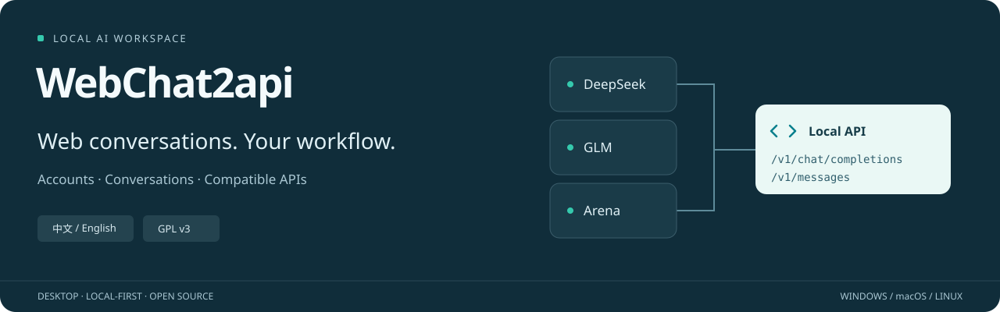
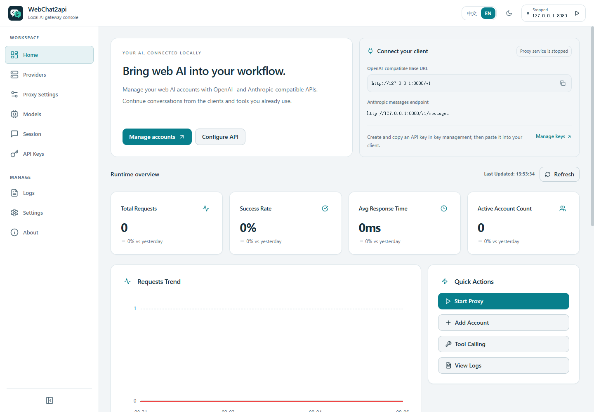

<p align="center">
  
</p>

<h1 align="center">WebChat2api</h1>
<p align="center">Manage your web AI accounts. Bring their conversations to your own clients.</p>
<p align="center"><a href="README.md">中文</a> | <strong>English</strong></p>
<p align="center"><a href="docs/README.md">Documentation</a> · <a href="docs/local-deployment.md">Local setup</a> · <a href="docs/claude-code.md">Claude Code</a> · <a href="https://github.com/ansujuner/WebChat2api/issues">Issues</a></p>



WebChat2api is a maintained derivative of **Chat2API**, built as an Electron desktop application. It manages accounts across providers and connects supported web conversations to an **OpenAI-compatible API** and an **Anthropic Messages-compatible interface**—for using your web accounts in your own clients, retaining conversation context, and checking account health.

> **Scope first:** Protocol compatibility does not provide every capability of a provider's native API. Login, manual verification, model access, subscriptions, and quotas remain controlled by the provider. A model appearing in the catalogue does not prove that your account can generate with it now. This repository provides source and local setup instructions; it does not promise downloadable installers for every platform.

## One desktop app, a few practical jobs

| Capability | Current behavior |
| --- | --- |
| **Real account liveness checks** | Sends one short message through the exact account. Only a complete, non-empty assistant reply passes. Check one account, one provider, or all accounts sequentially—without account fallback or automatic retries. |
| **Independent enable/disable and cooldowns** | Manual switches, credential status, and temporary cooldowns are stored separately. Disabled accounts are excluded from scheduling; cooldown expiry does not re-enable a manually disabled account. |
| **Account-bound sign-in** | Every built-in account has a direct sign-in-again entry. Arena reuses that account's original browser profile. Verified matching credentials update the original account, not a duplicate; custom API accounts offer "Update credentials". |
| **Retained web conversations** | Continuation-capable web adapters reuse the original conversation and send only new input or tool results upstream. System prompts and tool instructions initialize a new conversation only once. |
| **Claude Code and tool calls** | Supports Messages, streaming events, and client-side tool round trips. The Settings tool test performs two real, harmless turns rather than reporting connection success alone. |
| **Arena text and images** | Uses a normal Chrome/Edge profile dedicated to each account and its runtime model catalogue, with separate text continuation, single-image generation, and account/model limits. |
| **Per-provider proxy controls** | Each provider can inherit the default, use the system proxy, connect directly, or specify a proxy URL, covering login, model discovery, and chat. Route inspection distinguishes DIRECT from a proxy; it is not a connectivity test. See the [configuration guide](docs/network-login-update.md). |
| **Custom API providers** | Add an OpenAI-compatible Base URL, separate API-key accounts, and models. Includes model discovery, edit/delete, native tools, and two-turn checks. See the [setup guide](docs/providers/custom.md). |

## A look inside

**These screenshots show the current application with isolated demo data, not real accounts. Statistics, statuses, and example models do not establish real availability.** The banner above illustrates features; it is not a service availability report.



The individual page screenshots below use the Chinese UI; an [English dark-mode overview](docs/screenshots/preview-en-dark.png) is also available.

| Providers and accounts | Model management |
| :---: | :---: |
|  |  |

<details>
<summary>More current screens</summary>

[Dashboard (Chinese)](docs/screenshots/dashboard.png) · [Proxy](docs/screenshots/proxy.png) · [API keys](docs/screenshots/api-keys.png) · [Request logs](docs/screenshots/logs.png) · [Settings](docs/screenshots/settings.png) · [Sessions](docs/screenshots/Session.png) · [About](docs/screenshots/about.png) · [Full preview](docs/screenshots/preview.png)

</details>

## Run from source

**Download directly:** [v1.6.7 clean source ZIP](https://github.com/ansujuner/WebChat2api/releases/download/source-v1.6.7/WebChat2api-1.6.7-source.zip) · [Release notes and checksums](https://github.com/ansujuner/WebChat2api/releases/tag/source-v1.6.7). This is source, not an installer; accounts, logs, dependencies, and compiled output are excluded.

Requires **Node.js 22.18+** (Node.js 24 recommended) and npm. After extracting the ZIP, run the last three commands below inside `WebChat2api-1.6.7`; Git is not required for a downloaded archive. Alternatively, clone with Git. Runtime verification has primarily been on Windows; macOS/Linux build commands in the repository do not establish runtime verification on those platforms.

```bash
git clone https://github.com/ansujuner/WebChat2api.git
cd WebChat2api
npm ci
npm run build
npm start
```

`npm ci` automatically installs the pinned Electron runtime. The first installation needs network access to download dependencies and the runtime. If a download fails, restore connectivity and run it again rather than skipping install scripts and attempting to start.

On Windows, after `npm ci`, you can instead use the launcher to check the runtime, build, and start the app:

```powershell
.\scripts\start-local.ps1 -Build
```

For development with live updates, use `npm run dev:win` on Windows or `npm run dev` on macOS/Linux. See [local deployment](docs/local-deployment.md) for updates and safe restarts; do not clear your account directory to upgrade.

### Connect a client

1. Add or log into your account under **Providers**, then optionally run one **liveness check**. This consumes a real request and does not require the HTTP proxy to be running.
2. Start the proxy, read the **actual listening port** displayed in the app, and get a local gateway key from **API Key**.
3. Configure your client below. Choose a model from the app's currently enabled models or `GET /v1/models`, not an outdated copied model name.

| Client | Base URL | Key |
| --- | --- | --- |
| OpenAI-compatible client | `http://127.0.0.1:<port>/v1` | This app's gateway API key |
| Claude Code / Anthropic-compatible client | `http://127.0.0.1:<port>`, **without `/v1`** | The same gateway API key |

Replace `<port>` with the displayed value. Existing configuration is retained; one machine's port is not a universal default. Local clients use `127.0.0.1`, not the listener bind address `0.0.0.0`. **Do not use a website Token or Cookie as the client's API key.** See the [Claude Code guide](docs/claude-code.md) for the launcher, model configuration, and unsupported extensions.

## Providers and compatibility boundaries

Adapters are included for the following providers; generic OpenAI-compatible providers can also be added. Consult each guide and the current in-app catalogue for login methods, models, and restrictions:

[DeepSeek](docs/providers/deepseek.md) · [GLM](docs/providers/glm.md) · [Kimi](docs/providers/kimi.md) · [MiniMax](docs/providers/minimax.md) · [MiMo](docs/providers/mimo.md) · [Perplexity](docs/providers/perplexity.md) · [Qwen China](docs/providers/qwen.md) · [Qwen AI Global](docs/providers/qwen-ai.md) · [Z.ai](docs/providers/zai.md) · [Arena](docs/providers/arena.md)

- **Liveness is not an all-model certification.** A pass concerns only the selected account, model, and request. Batch checks skip manually disabled accounts/providers. An explicit single-account check can test a disabled or stale-status account without enabling it; cooldowns, daily limits, and known bans still apply. Stopping cancels the remaining queue; an already submitted request may need to finish. See [account liveness](docs/account-liveness.md) and [scheduling, cooldowns, and limits](docs/account-scheduling.md).
- **Continuation never guesses the account's “last chat.”** Clients may send full history; the proxy sends only the delta upstream when it matches the same web conversation. Model/system/tool changes, unmatched history, and app restarts may require a new conversation. Generic OpenAI API providers remain stateless and receive history. Clients sending only the latest input can use `X-Chat2API-Session-ID`; see [continuation rules](docs/providers/conversation-continuity.md).
- **Protocol compatibility is not a Claude model service.** Web models do not become Claude. Tools run in the client under its own permissions. `count_tokens` is a local estimate, not accurate billing; Anthropic server-side tools, signed thinking, and native prompt caching are not provided. Invalid tool arguments or incomplete streams are not reported as successful completions.
- **Arena retains website restrictions.** Each account uses a separate browser profile and real catalogue; required manual verification pauses the flow rather than being bypassed. Image support is single text-to-image generation with URL output and automatic website sizing—not editing, batches, or specified resolutions. Local limits are not a promise of upstream quota. See the [Arena guide](docs/providers/arena.md).
- **Provider-specific checks still apply.** Z.ai uses the normal submission flow in its account-owned website session. `FRONTEND_CAPTCHA_REQUIRED` may still require attention in the actual chat/verification window, without automatic retries. Website sign-in alone is not a successful liveness check. Perplexity model access depends on your subscription plan; not every model is free.

## Documentation and verification

The detailed guides are currently primarily in Chinese. Start with the bilingual [documentation index](docs/README.md).

| Task | Guide |
| --- | --- |
| Install, start, update, or restart | [Local deployment](docs/local-deployment.md) |
| Configure Claude Code and check tool calls | [Claude Code integration](docs/claude-code.md) |
| Understand account checks, disablement, and recovery | [Real liveness checks](docs/account-liveness.md) · [Account scheduling](docs/account-scheduling.md) |
| Troubleshoot login browsers or system proxies | [Network and login](docs/network-login-update.md) |
| Review verification scope and historical audits | [Publication checks](docs/release-validation.md) · [Full documentation index](docs/README.md) |

Use `npm test` and `npm run build` for development checks. Passing local fixtures, a build, or `/health` does not establish successful upstream generation. Dated records describe their historical scope only. Real-request diagnostics are opt-in and do not retry automatically. When filing an issue, include the version, provider, model, and a sanitized error; **never upload account stores, browser profiles, Cookies, Tokens, API keys, or unchecked logs/traffic captures**.

## License and acknowledgements

This is a maintained derivative of **Chat2API**, retaining the original attribution to **Chat2API Team**, under **GPL-3.0-or-later**. See [LICENSE](LICENSE) for the full terms, and [NOTICE](NOTICE) and [MODIFICATIONS.md](MODIFICATIONS.md) for original-project attribution and modification notes.

Provider branding identifies compatible services, not official partnership or endorsement. Their logos and trademarks **are not relicensed under GPL by this project**. Official asset sources and rights notices are recorded in [THIRD_PARTY_ASSETS.md](THIRD_PARTY_ASSETS.md).
